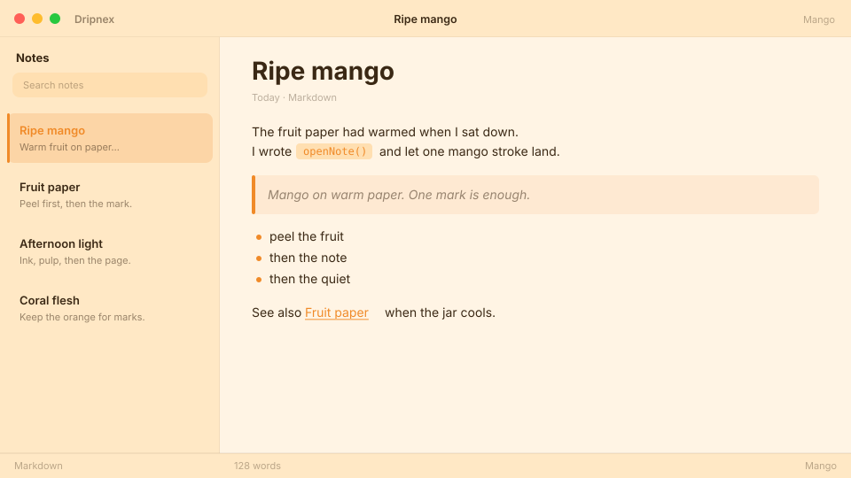

# Mango

Good vibes mango. Warm fruit paper.



```
dripnex/theme-mango
```

## Palette

The chips live in [palette.html](palette.html) — open it in a browser. GitHub won’t paint HTML swatches here, so the hex list is below.

| Name | Token | Color | What it’s for |
| --- | --- | --- | --- |
| Base | `--bg-base` | `#fff4e4` | Window background |
| Surface | `--bg-surface` | `#ffe8c5` | Sidebar and chrome |
| Elevated | `--bg-elevated` | `#fffcf9` | Raised panels |
| Text | `--text-primary` | `#3a2814` | Headings and body |
| Muted | `--text-muted` | `#3a2814 · rgba(58, 40, 20, 0.52)` | Secondary copy |
| Accent | `--accent` | `#f08a28` | Selection and links |
| Active | `--status-active` | `#f08a28` | Active status |
| Dropped | `--status-dropped` | `#c45a5a` | Dropped status |

Pick it for warm fruit paper and mango orange — not apricot peach, not dune terracotta.
